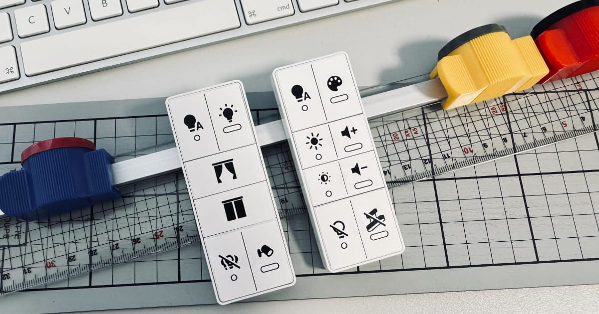

# Remote Label Designer for Home Automation

**aka: ha-remote-designer**

👉 **Try the tool:** https://ha-remote-designer.netlify.app/

Design printable button labels for physical smart-home remotes – without graphic design tools.

---

## Why this exists

When you start using physical remotes in a smart-home setup, they quickly become more powerful than the manufacturer ever intended.

Single press.  
Double press.  
Long press.

After a few weeks, nobody remembers what does what.

This problem exists in **every smart-home ecosystem**:

- Home Assistant
- Apple Home
- Zigbee / Matter setups
- mixed systems with multiple bridges

Labeling sounds trivial, but in practice it isn’t:

- Paper stickers don’t last
- Handwritten labels look messy
- Graphic design tools are overkill
- Consistent sizing is hard
- Printing at the correct scale is error-prone

**Remote Label Designer** closes the gap between automation logic  
and the physical remote in your hand.

---

## Try it online

You can try the current prototype directly in your browser:

👉 https://ha-remote-designer.netlify.app/

No installation required. No account needed.

---

## What this tool does (current state)

- Design simple, consistent labels for physical smart-home remotes
- Focus on **buttons**, not full remote skins
- Export labels as **SVG**
- Optional print calibration reference (10 mm)
- Save your configured remotes locally in your browser (localStorage)
- Reload and continue editing later
- No accounts
- No cloud
- No vendor lock-in

This is intentionally a **community prototype**.

---

## What this tool is NOT (yet)

- No PDF export
- No PNG export
- No perfect print templates
- No professional sticker service

These may come later — **after validating real-world usage**.

---

## Why SVG first?

SVG is a deliberate choice.

The goal of this project is **real-life testing**, not perfect printing:

- Print it at home
- Cut it
- Stick it on a remote
- Use it for a few days

If the idea fails at this stage, higher-end formats won’t fix it.

High resolution (300 DPI) ensures:

- readable text
- realistic size evaluation
- fair feedback on the concept itself

---

## Print calibration (important)

Exported PNGs can include an optional calibration reference:

- 10 mm line

Before judging size accuracy:

1. Print at **100%**
2. Disable “scale to fit” or similar options
3. Measure the reference with a ruler

If the reference is correct, your labels are correct.

---

## Who this is for

- People using physical smart-home remotes
- Home Assistant users
- Apple Home users
- Zigbee / Matter users
- Anyone who assigned _more than one action per button_

If you never forget what your buttons do, you probably don’t need this.

---

## What does “HA” mean?

**HA stands for Home Automation.**

The tool is **not limited to Home Assistant**. Home Assistant is just one ecosystem where the problem becomes obvious quickly.

---

## Planned direction (not a promise)

- More remote presets
- Better layout controls
- Optional SVG / PDF export improvements
- Material experiments (vinyl, outdoor-safe)
- Optional sticker service (e.g. plotter / cutting machine)

Nothing here is guaranteed. Community feedback will decide.

---

## Feedback wanted

Please test the tool first: 👉 https://ha-remote-designer.netlify.app/

This project lives or dies by real usage.

Please open an issue if you can answer any of these:

- Does this solve a real problem for you?
- Which remotes are missing?
- Which button sizes do you actually need?
- Is SVG sufficient for your workflow?
- What went wrong when printing or sticking?

Photos of real remotes are especially helpful.

---

## License

This project is licensed under the MIT License.

You are free to use, modify and share it. Attribution is appreciated.

---

## Status

Early prototype.  
Expect rough edges.  
Expect changes.

If it helps you even a little, that’s already a win.

---

## Why Open Source?

This project is open source on purpose.

The value of this tool is not the code itself, but solving a very practical, real-world problem: making physical smart-home remotes readable again.

Open sourcing the tool allows:

- real-world feedback
- community trust
- experimentation across different ecosystems

Future services (such as printed stickers or material-based solutions) are intentionally **out of scope** for this repository.

Open source code and optional paid services are not a contradiction. They solve different problems.
